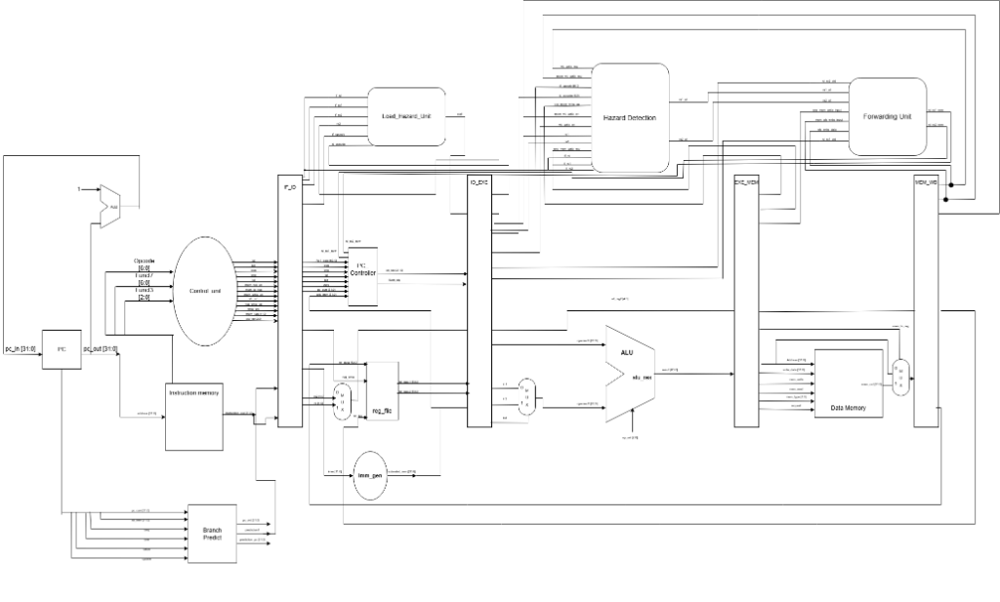

# Pipelined RISC-V Processor (RV32I)

A production-grade, cycle-accurate implementation of a 5-stage pipelined RISC-V processor supporting the **RV32I Base Integer Instruction Set**. Designed for high-frequency synthesis and verified through simulation testbenches.

---

## 1. System Overview

This processor executes instructions in a classic 5-stage pipeline, leveraging dedicated hazard detection and data forwarding units to achieve a high Instructions Per Cycle (IPC) count while maintaining structural and functional correctness.

### Key Architectural Specs:
- **ISA support:** RV32I Base Integer Instruction Set.
- **Pipeline depth:** 5 stages (Fetch, Decode, Execute, Memory, Write-back).
- **Target Technology:** Altera/Intel FPGA (Quartus Prime synthesis files included).
- **Clocking:** Integrated PLL IP for clock domain management.

---

## 2. Architecture & Datapath

The processor datapath is partitioned into the following sequential pipeline stages:

1. **Instruction Fetch (IF):** Fetches instructions from Instruction Memory utilizing the Program Counter (PC). Includes basic branch prediction logic to minimize control flow stalls.
2. **Instruction Decode (ID):** Decodes instructions, reads operands from the Register File (32 general-purpose 32-bit registers), and generates immediate values (ImmGen).
3. **Execute (EXE):** Performs arithmetic, logic, and branch target address evaluations via a highly optimized Arithmetic Logic Unit (ALU).
4. **Memory Access (MEM):** Interacts with Data Memory for load (`LW`, etc.) and store (`SW`, etc.) operations.
5. **Write-Back (WB):** Routes instruction results or memory-loaded data back to the register file destination register.

### Datapath Block Diagram


### Hazard Resolution Logic
To maintain pipeline execution flow and avoid data corruption or erroneous control paths, the processor includes dedicated hardware units for hazard resolution:

* **Forwarding Unit (Data Hazards):** Resolves RAW (Read-After-Write) register hazards by routing operands directly from the output of the **EXE/MEM** or **MEM/WB** pipeline registers back to the ALU inputs, bypassing the Register File when an instruction depends on a previous instruction's writeback result that has not yet completed.
* **Hazard Detection Unit (Load-Use Hazards):** If a load instruction (e.g., `LW`) is followed immediately by an instruction that reads the loaded register as an operand, forwarding is physically impossible because the data is only available after the MEM stage. The Hazard Detection Unit stalls the pipeline by disabling write access to the PC and the IF/ID pipeline register, injecting a bubble (`NOP`) into the ID/EXE register.
* **PC Controller & Branch Prediction (Control Hazards):** Manages control flow changes due to branch/jump executions. When a branch misprediction occurs, the pipeline controller flushes instructions currently in the IF/ID stage, restoring correct execution flow without pipeline corruption.

---

## 3. Toolchain & Verification

The project is structured to compile and synthesize using **Intel Quartus Prime** and simulate utilizing **ModelSim / QuestaSim**.

### Simulation Waveform Screenshot
```
[Insert Simulation Waveform Screenshot Here]
```

### Directory Structure
```
├── docs/       # Architecture documents & draw.io datapath designs
├── rtl/        # Synthesizable RTL source files (.v)
│   ├── discreteModules/   # Core components (ALU, RegFile, PC, Muxes, Memory)
│   ├── pipelineStages/    # Sequential logic for IF, ID, EXE, MEM, WB stages
│   └── pipelinedRegisters/ # Register boundaries (IF/ID, ID/EXE, EXE/MEM, MEM/WB)
├── scripts/    # Quartus project settings, PLL configuration, and simulator scripts
├── tb/         # Testbench source files
└── README.md   # System documentation
```

---

## 4. Getting Started

### Prerequisites
- A Verilog simulator (e.g., ModelSim, QuestaSim, Icarus Verilog, or Verilator).
- **Intel Quartus Prime** (for compilation and FPGA synthesis).

### Running the Verification Suite
To run the primary testbench using a standard simulator (e.g., ModelSim/QuestaSim) from the repository root:

```bash
# Navigate to the testbench directory
cd tb

# Compile all design RTL and testbench files (example command for ModelSim cmdline tools)
vlib work
vlog ../rtl/discreteModules/*.v ../rtl/pipelinedRegisters/*.v ../rtl/pipelineStages/*.v ../rtl/*.v testbench.v

# Start the simulation in command line or GUI mode
vsim -c -do "run -all; quit" work.testbench
```
